[](https://img.shields.io/badge/license-UPL-green) [](https://sonarcloud.io/dashboard?id=oracle-devrel_tech-content-heatwave)

# Deploy AskME resources with terraform

This section explains how to deploy AskME in your tenancy, using the OCI Cloud Shell and terraform. The following resources are automatically created during the process:
-	A dynamic group and a policy in the root compartment
-	A Compartment for the AskME resources
-	An Object Storage bucket containing two documents
-	A Compute Instance to run the AskME app
-	A MySQL DBSystem with a HeatWave cluster
-	A Vault, a Vault key and three Vault secrets
-	A VCN with an Internet Gateway, two Security Lists and two Subnets

The application can then be accessed from your local machine, using local port forwarding, as detailed in [step 8](#step-8-use-askme).

## Step 1: Open OCI Cloud Shell
Sign In to [your OCI tenancy](http://cloud.oracle.com/), switch to a [region supporting OCI Generative AI](https://docs.oracle.com/en-us/iaas/Content/generative-ai/overview.htm#regions) (e.g: US Midwest), and open the Cloud Shell.
You need to have the [Administrator role](https://docs.oracle.com/en-us/iaas/Content/Identity/roles/understand-administrator-roles.htm) to deploy the AskME resources in your tenancy.

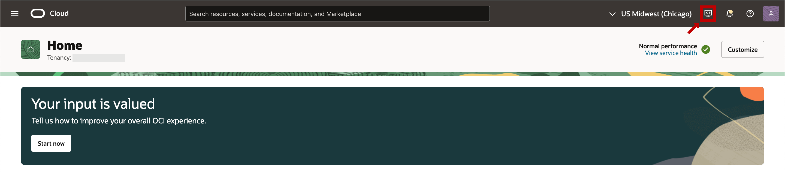

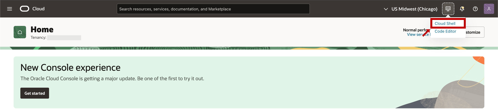

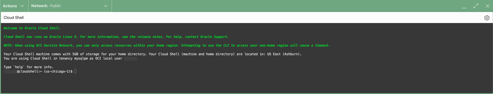

## Step 2: Get the repository archive
In the Cloud Shell interface, fetch the tech-content-heatwave repository archive.

Command:
```
wget -O tech-content-heatwave.zip -nv https://github.com/ivanxma/askme/raw/refs/heads/main/download/tech-content-heatwave3.zip
```

## Step 3: Unzip the archive
Command:
```
unzip tech-content-heatwave.zip '*/askme/*' -d tech-content-heatwave
```

## Step 4: Change directory to the terraform folder
Command:
```
cd tech-content-heatwave/*/askme/terraform
```

## Step 5 (optional): Create a screen session to run terraform
Command:
```
screen -S askme_session
```

## Step 6: Run the setup script
Run the script `askme_setup.sh`, and follow the instructions. Additional information will be asked by the script to setup the DBSystem and the compute instance.

Command:
```
sh askme_setup.sh
```


### Step 6.a: Compartment name

Name of the AskME demo compartment to create (default: `heatwave-genai-askme`).

If your tenancy already contains a compartment with the default name `heatwave-genai-askme`, please provide another compartment name and press Enter. Otherwise, no need to provide a value, press Enter and the default value will be used.

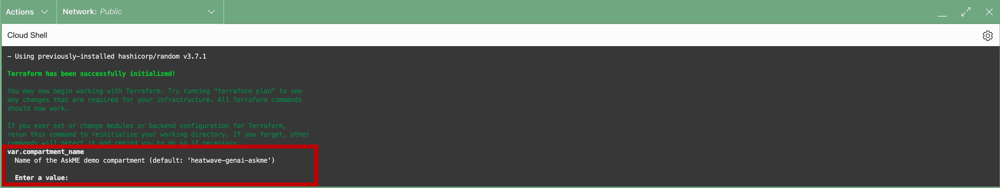


### Step 6.b: Allowed IPv4 CIDR block

Set of IPv4 addresses (CIDR notation) allowed to connect to the compute instance.

The CIDR notation follows the format: `a.b.c.d/e` where `a`, `b`, `c` and `d` are numbers between 0 and 255, and `e` is a number between 0 and 32. More information about the CIDR block notation in the [Network Overview](https://docs.oracle.com/en-us/iaas/Content/Network/Concepts/overview.htm#:~:text=CIDR%20NOTATION) page.

Use `0.0.0.0/0` to indicate all IP addresses. The prefix is required (for example, include the /32 if specifying an individual IP address). For more information, check the [Security Rules](https://docs.oracle.com/en-us/iaas/Content/Network/Concepts/securityrules.htm) page.


### Step 6.c: SSH authorized key

Content of the SSH public key file (OpenSSH format) located in your local machine. More information about SSH keys in the [Key Pair management and generation](https://docs.oracle.com/en-us/iaas/Content/Compute/Tasks/managingkeypairs.htm) page.

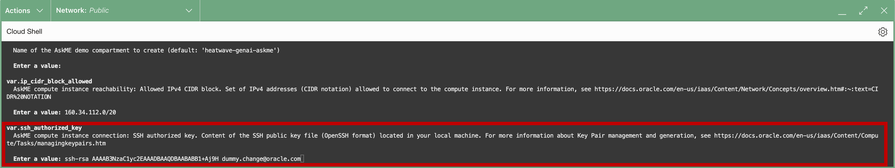

## Step 7: Resource deployment
Wait until the terraform deployment finishes. Expected deployment time: 30-40 minutes.

## Step 8: Use AskME
Connect to the AskME compute instance and access the streamlit page.
Follow the instructions provided in the Cloud Shell output. The instructions should look similar to this:
```
================================================
Open a terminal in your local computer, and run:
  ssh -L 8501:localhost:8501 opc@x.x.x.x
Then in your web browser, open the URL:
  127.0.0.1:8501
================================================
```

This information can be displayed again with the command `sh askme_output.sh` from the location described in [step 4](#step-4-change-directory-to-the-terraform-folder).


# Cleanup AskME resources with terraform

This section explains how to remove AskME resources from your tenancy, using the OCI Cloud Shell and terraform.

#### Warning: Cleanup setup requirement
Please make sure that the AskME resources have been created following the [deployment instructions](#deploy-askme-resources-with-terraform), and that the setup folders/files located in [deployment step 4](#step-4-change-directory-to-the-terraform-folder) have not been modified or removed since the last deployment.

More specifically, please make sure that the file `terraform.tfstate` still exists there. If not, all resources described in the [deployment instructions](#deploy-askme-resources-with-terraform) need to be removed manually.

#### Warning: Cleanup retention period
There is a retention period of 30 days before the OCI Vault can be removed, blocking the compartment deletion. Please rerun the [cleanup step 2](#step-2-run-the-cleanup-script) again after 30 days to complete the cleanup process.

## Step 1: Remove Vector Tables in the AskME app (if any)
Follow the instructions in [step 8](#step-8-use-askme) to access the streamlit page.
In the `Knowledge Base Management` tab, go to the section `Reset Knowledge Base` and follow the page instructions to remove all vector store tables.


## Step 2: Run the cleanup script
Follow the instructions in [deployment step 1](#step-1-open-oci-cloud-shell) and [deployment step 4](#step-4-change-directory-to-the-terraform-folder) to use the Cloud Shell from the right location.

Run the script `sh askme_cleanup.sh`, and follow the instructions. Additional information will be asked by the script to choose the right compartment name.

Command:
```
sh askme_cleanup.sh
```

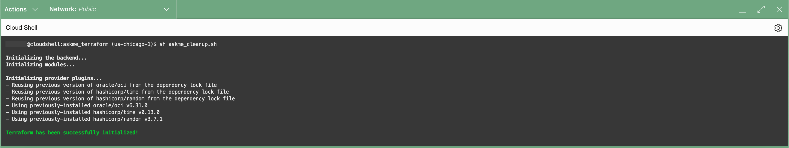

### Step 2.a: Compartment name

Name of the AskME demo compartment to delete (default: `heatwave-genai-askme`).

If you used a custom compartment name in [deployment step 6.a](#step-6a-compartment-name), please provide the same compartment name here and press Enter. Otherwise, no need to provide a value, press Enter and the default value will be used.


# Troubleshooting

## Compartment already exists

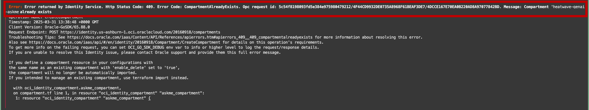

If the compartment already exists in your tenancy, please rerun the [step 6](#step-6-run-the-setup-script) and specify another compartment name in [step 6.a](#step-6a-compartment-name).

## Current OCI region does not support Generative AI

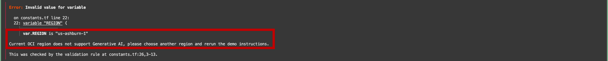

Please close the current Cloud Shell session:


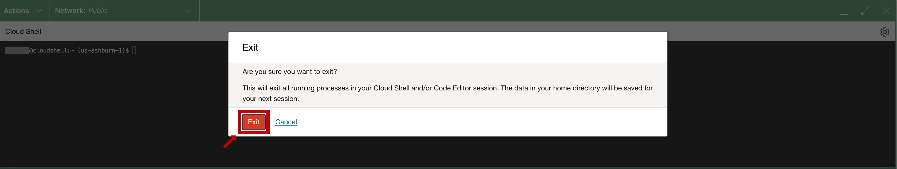

Then change the OCI Console region to a [region supporting OCI Generative AI](https://docs.oracle.com/en-us/iaas/Content/generative-ai/overview.htm#regions) (e.g: US Midwest):


Then reopen the Cloud Shell ([step 1](#step-1-open-oci-cloud-shell)) and in the same folder as in [step 4](#step-4-change-directory-to-the-terraform-folder), please rerun [step 6](#step-6-run-the-setup-script).

## Compartment name length must be between 4 and 20

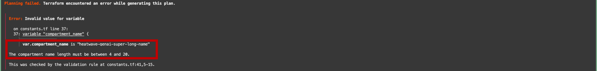

Please rerun [step 6](#step-6-run-the-setup-script) and use a smaller/longer compartment name in [step 6.a](#step-6a-compartment-name).

## Invalid IPv4 CIDR block notation

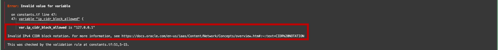

Please rerun [step 6](#step-6-run-the-setup-script) and provide a valid IPv4 block range in [step 6.b](#step-6b-allowed-ipv4-cidr-block), following the CIDR block notation.

More information about the CIDR block notation in the [Network Overview](https://docs.oracle.com/en-us/iaas/Content/Network/Concepts/overview.htm#:~:text=CIDR%20NOTATION) page.

## The SSH public key value must follow the OpenSSH format

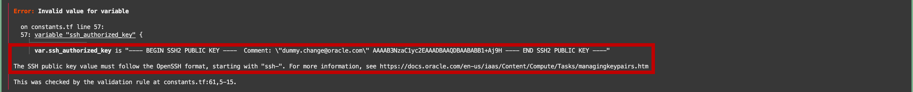

Please rerun [step 6](#step-6-run-the-setup-script) and provide a valid SSH public key in [step 6.c](#step-6c-ssh-authorized-key), following the OpenSSH format.

More information about SSH keys in the [Key Pair management and generation](https://docs.oracle.com/en-us/iaas/Content/Compute/Tasks/managingkeypairs.htm) page.
