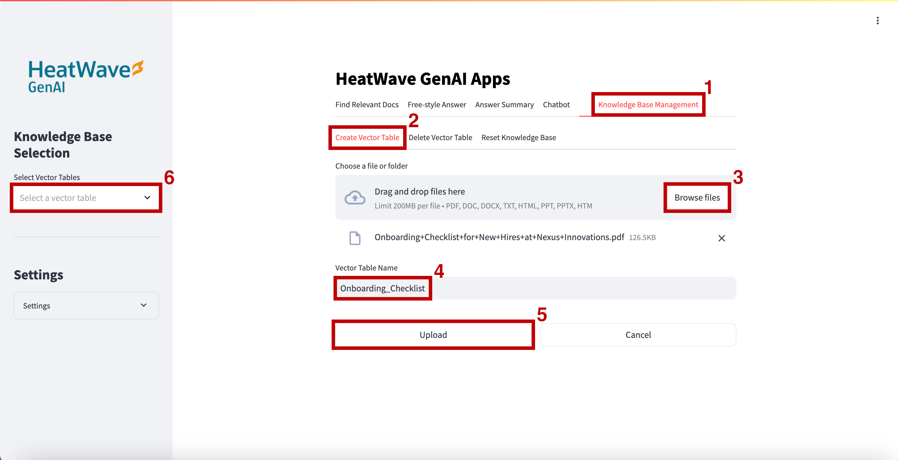
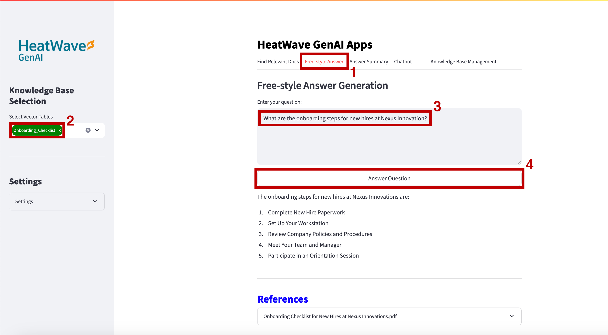

 

# HeatWave GenAI Apps: AskME
AskME is a suite of features designed to empower users to maximize the potential of their data utilizing cutting-edge artificial intelligence capabilities offered by HeatWave GenAI. This comprehensive solution offers the following functionalities:

1.	Find Relevant Documents: Users can provide a prompt, and AskME will retrieve and present relevant documents in a user-friendly manner.

2.	Free-Style Answer Generation: Users can ask questions, and AskME will include relevant information from the knowledge base to answer the question.

3.	Summarized Answer Generation: Users can ask questions, and AskME will summarize relevant information from the knowledge base which is related to the question.

4.	Chatbot Functionality: AskME allows users to ask follow-up questions and review their chat history.

5.	Knowledge Base Management: Users can create and delete the vector tables.

## Prerequisite

You must have an OCI account. [Click here](https://docs.oracle.com/en/cloud/paas/content-cloud/administer/create-and-activate-oracle-cloud-account.html) for more information about Oracle Cloud account creation and activation. Free-tier accounts are currently not supported for the deployment of AskME resources.

There are required OCI resources (see the [Terraform documentation](./terraform/README.md) for more information) that are needed for this tutorial.

## Getting Started: answer questions using your documents

### Create a vector table

In the AskME app, it is easy to use your documents to create a new vector table.

    

From the `Knowledge Base Management` tab (${\textsf{\color{red}1}}$), under `Create Vector Table` (${\textsf{\color{red}2}}$), you can choose to upload one or more documents to AskME (${\textsf{\color{red}3}}$):
- Here is a sample document you can download and use for that purpose: [Onboarding Checklist for New Hires at Nexus Innovations.pdf](./assets/Onboarding%20Checklist%20for%20New%20Hires%20at%20Nexus%20Innovations.pdf) 
- Feel free to use your own documents to try the vector table creation.

After having browsed and selected the relevant files, you can change the vector table name if the default one does not match your needs (${\textsf{\color{red}4}}$). 
This name will be used to identify the vector table, and may correspond to the common denominator of all selected files.

Then click on the `Upload` button to start the vector table creation process (${\textsf{\color{red}5}}$). 
For the sample document provided earlier, this process should take 30-60 seconds. It may take several minutes if multiple files/bigger files are selected.

Once the vector table has been created, a green message is displayed, explaining that the table creation was successful, and the new table name should be added to the `Selected Vector Tables` list (${\textsf{\color{red}6}}$).
 

### Use the vector table to answer questions

Any existing vector table can be used in AskME to generate an accurate answer, with references to the original documents.

    

From the `Free-style Answer` tab (${\textsf{\color{red}1}}$), you can enter your question in the input field (${\textsf{\color{red}3}}$). 
Here, we choose to ask a question related to the sample document uploaded in the previous section: *What are the onboarding steps for new hires at Nexus Innovation?*

Please make sure that all vector tables needed for the question are selected in the Knowledge Base Selection area (${\textsf{\color{red}2}}$), and then you can click on the `Answer Question` button (${\textsf{\color{red}4}}$).

The answer should appear under the `Answer Question` button after a few seconds, followed by a clickable list of document references that have been used to generate the answer.

## Contributing

This project is open source.  Please submit your contributions by forking this repository and submitting a pull request!  Oracle appreciates any contributions that are made by the open source community.

## Acknowledgments

- [Oracle Cloud Infrastructure (OCI)](https://www.oracle.com/cloud/)
- [Streamlit Documentation](https://docs.streamlit.io/)

## Security

Please consult the [security guide](./SECURITY.md) for our responsible security
vulnerability disclosure process.

## License

Copyright (c) 2025 Oracle and/or its affiliates.

Licensed under the Universal Permissive License (UPL), Version 1.0.

See [LICENSE](LICENSE) for more details.

For third party licenses, see [THIRD_PARTY_LICENSES](licenses/THIRD_PARTY_LICENSES.txt).

For HeatWave User Guide legal information, see the [Legal Notices] (https://dev.mysql.com/doc/heatwave/en/preface.html#legalnotice).

ORACLE AND ITS AFFILIATES DO NOT PROVIDE ANY WARRANTY WHATSOEVER, EXPRESS OR IMPLIED, FOR ANY SOFTWARE, MATERIAL OR CONTENT OF ANY KIND CONTAINED OR PRODUCED WITHIN THIS REPOSITORY, AND IN PARTICULAR SPECIFICALLY DISCLAIM ANY AND ALL IMPLIED WARRANTIES OF TITLE, NON-INFRINGEMENT, MERCHANTABILITY, AND FITNESS FOR A PARTICULAR PURPOSE.  FURTHERMORE, ORACLE AND ITS AFFILIATES DO NOT REPRESENT THAT ANY CUSTOMARY SECURITY REVIEW HAS BEEN PERFORMED WITH RESPECT TO ANY SOFTWARE, MATERIAL OR CONTENT CONTAINED OR PRODUCED WITHIN THIS REPOSITORY. IN ADDITION, AND WITHOUT LIMITING THE FOREGOING, THIRD PARTIES MAY HAVE POSTED SOFTWARE, MATERIAL OR CONTENT TO THIS REPOSITORY WITHOUT ANY REVIEW. USE AT YOUR OWN RISK.

